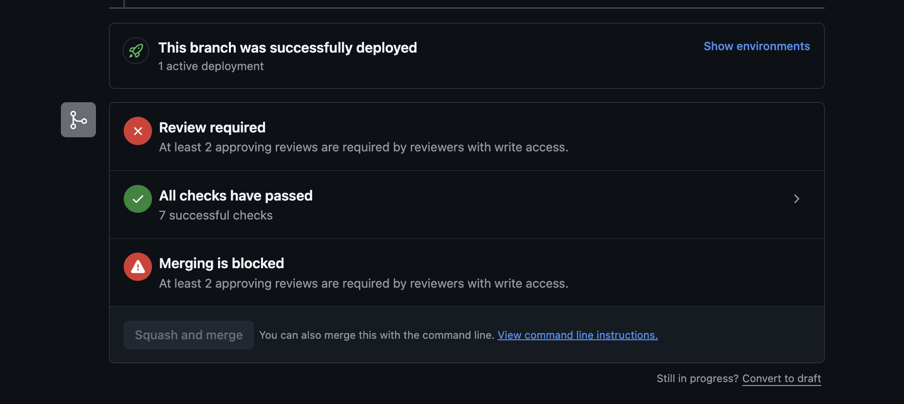
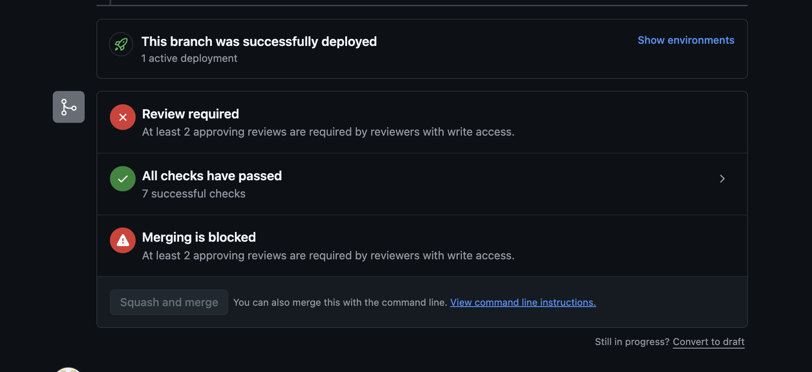
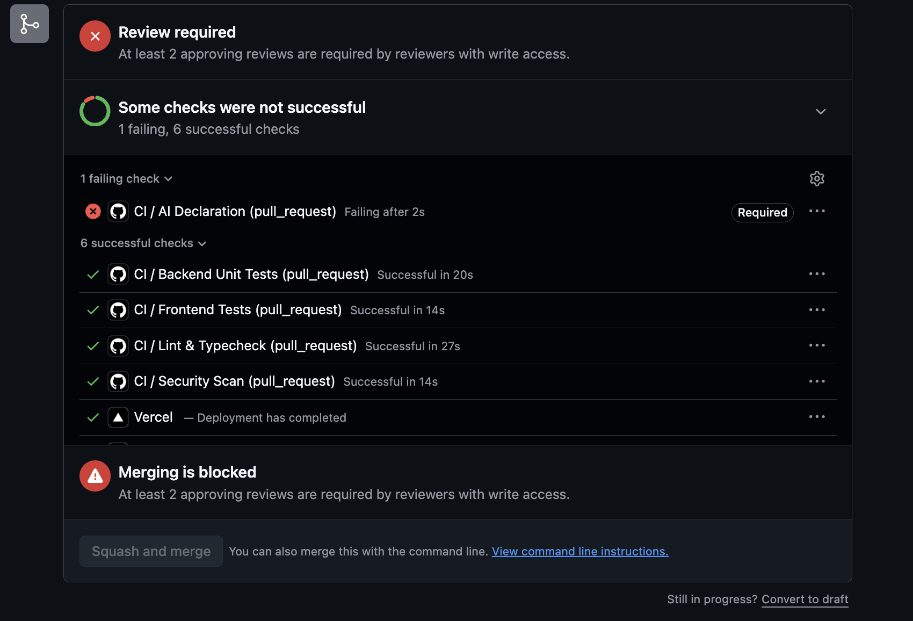
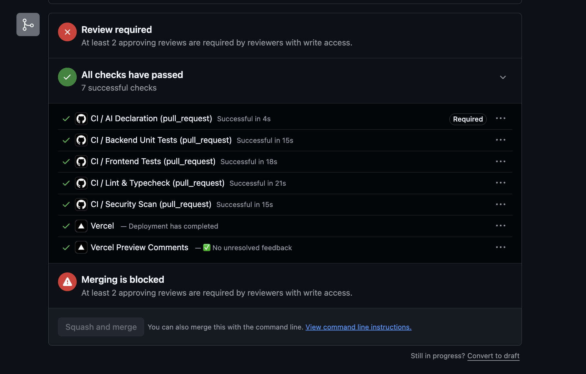

## Test 1: Unapproved PR merge blocking

**Control type:** Human

**Test PR:** #43

**Owner account test**
- Account: Chirag123213
- Result: Merge blocked
- GitHub message: "At least 2 approving reviews are required by reviewers with write access."
- All CI checks had passed, confirming the missing approvals were the blocking condition.

Evidence from Chirag123213 account (owner)

**Collaborator account test**
- Account: Chirag361
- Result: Merge blocked
- GitHub message: "At least 2 approving reviews are required by reviewers with write access."
- All CI checks had passed, confirming the missing approvals were the blocking condition.

**Result:** PASS — an unapproved PR cannot be merged by either the repository owner or a collaborator.

## Test 2: Unanswered AI declaration fails CI

**Control type:** CI check

**Test PR:** #43

The AI-use declaration was edited so that neither declaration option was selected.

Result: PASS — the required `AI Declaration` CI check failed while the remaining checks passed.

After verification, the correct AI-assisted option was restored and the `AI Declaration` check passed again.

## Test 3: Slice 2 deployment checks

**Control type:** Human verification

### Vercel preview URLs

Verified that Vercel creates branch-specific preview deployments for pull requests.

Evidence was confirmed on PRs #9, #14, and #43, where Vercel posted working preview URLs.

**Result:** PASS — PR preview deployment is active.

### Firestore deployment workflow

The repository previously contained:

`.github/workflows/deploy.yml_notinuse`

so GitHub Actions did not execute the Firestore deployment workflow.

After team approval, the workflow was enabled as:

`.github/workflows/deploy.yml`

The automatic trigger is restricted to changes to:

`firebase/firestore.rules`

on pushes to `main`.

Required GitHub Actions secrets were also confirmed:
- `FIREBASE_PROJECT_ID`
- `FIREBASE_SERVICE_ACCOUNT_KEY_BASE64`

**Result:** PASS — Firestore security rule changes can now be deployed automatically when merged to `main`.
